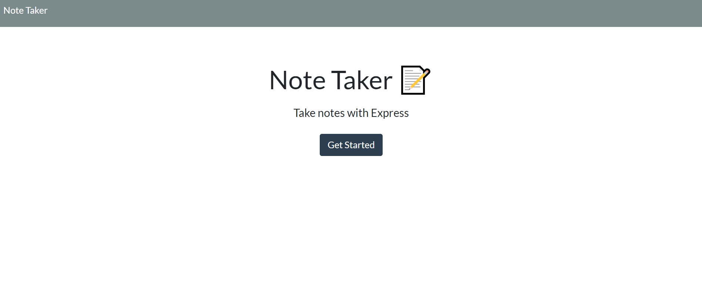
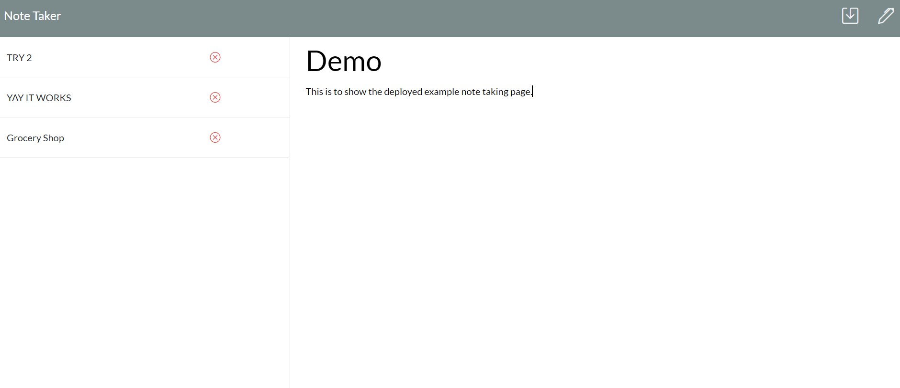

# Note Taker


## Description

An application called Note Taker that can be used to write and save notes. This application will use an Express.js back end and will save and retrieve note data from a JSON file.

## Table of Contents

-  [User Story](#user-story)
-  [Acceptance Criteria](#acceptance-criteria)
-  [Application Examples](#application-examples)
-  [Deployment](#deployment)
-  [Credits](#credits)
-  [License](#license)
-  [Questions](#questions)

## User Story

```
AS A small business owner
I WANT to be able to write and save notes
SO THAT I can organize my thoughts and keep track of tasks I need to complete
```

## Acceptance Criteria

```
GIVEN a note-taking application
WHEN I open the Note Taker
THEN I am presented with a landing page with a link to a notes page
WHEN I click on the link to the notes page
THEN I am presented with a page with existing notes listed in the left-hand column, plus empty fields to enter a new note title and the note’s text in the right-hand column
WHEN I enter a new note title and the note’s text
THEN a "Save Note" button and a "Clear Form" button appear in the navigation at the top of the page
WHEN I click on the Save button
THEN the new note I have entered is saved and appears in the left-hand column with the other existing notes and the buttons in the navigation disappear
WHEN I click on an existing note in the list in the left-hand column
THEN that note appears in the right-hand column and a "New Note" button appears in the navigation
WHEN I click on the "New Note" button in the navigation at the top of the page
THEN I am presented with empty fields to enter a new note title and the note’s text in the right-hand column and the button disappears
```

## Application Examples





## Deployment

[Note-Taker Repo](https://github.com/ruthiepina/Note-Taker)

[Deployed Application](https://module11-note-taker-b70c7ad21935.herokuapp.com/)

## License

Copyright (c) 2024 Ruthie Pina. All rights reserved.

Licensed under the [MIT License](https://choosealicense.com/licenses/mit).

## Questions

Note-Taker application created by [Ruthie Pina](https://github.com/ruthiepina).

For any additional questions or comments, please send a message to the following address:

GitHub Email Address: <ruthiepina@gmail.com>
